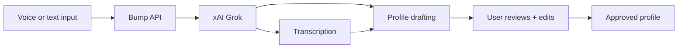
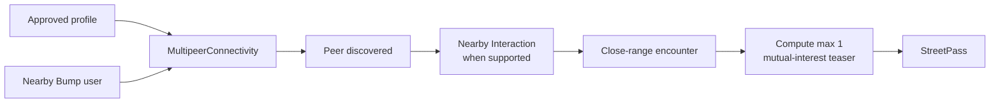
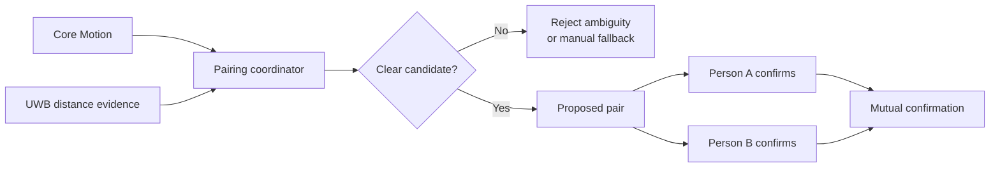
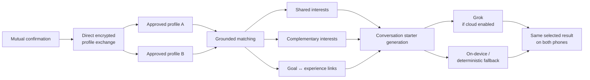

**Meet someone. Find your overlap.**

Two people tap their phones together, confirm each other, and get the specific things they actually have in common, plus a few grounded talking points to open with. No account, no feed, no API key on the phone.

<!-- TODO: add a license badge once LICENSE exists -->

[Problem](#the-problem) · [What it does](#what-it-does) · [Demo](#demo) ·
[How it works](#how-it-works) · [Tech stack](#tech-stack) · [Roadmap](#roadmap) ·
[Team](#team--acknowledgments)

---

## The problem

**The people you would get along with may already be in the room. You just don't know what to say to them yet.**

Before class, at a hackathon, or waiting for an event to begin, people can stand a few feet apart and never speak. That small moment sits inside a much larger problem: the [WHO Commission on Social Connection](https://www.who.int/groups/commission-on-social-connection) estimates that roughly **1 in 6 people worldwide experience loneliness**. But the missed connection itself often happens somewhere much more ordinary: two people have an opportunity to talk, and neither knows whether to begin.

Research suggests that this uncertainty is often miscalibrated. [Epley & Schroeder (2014)](https://doi.org/10.1037/a0037323) found that commuters assigned to talk with a stranger reported more positive experiences than those assigned to remain disconnected, even though separate participants predicted the opposite. Across seven studies, [Sandstrom & Boothby (2021)](https://doi.org/10.1080/15298868.2020.1816568) similarly found that people's fears before talking to strangers were generally worse than the conversations that followed. **Silence is weak evidence that a conversation would be unwelcome.**

But willingness alone does not tell you what to say. A stranger gives you almost no context. You have to guess what they care about, whether you share anything, and which opening will actually land. **"We both like music" is trivia. "You build modular synths too?" is a conversation.**

Not every similarity carries the same signal. [Alves (2018)](https://doi.org/10.1177/0146167218766861) found that sharing rarer interests produced stronger interpersonal attraction than sharing common ones, suggesting that distinctive overlap can reveal more than broad similarity. Two people can already share the thing that would start a ten-minute conversation and still walk past each other without ever finding out.

**The common ground already exists. The missing piece is seeing it when it matters.**

## What it does

**Bump gives two people who are already near each other just enough common ground to start talking.**

Create a lightweight profile from a short spoken introduction, then edit it until it feels like you. When someone nearby also has Bump open, **Wave can surface one shared-interest teaser**. Enough to make you curious. Not enough to replace meeting them.

See someone you want to meet? **Bump your phones together.** Once both people confirm the interaction, Bump reveals a few specific things you genuinely have in common, along with grounded conversation starters.

> **you both like music**  
> useful, but broad.
>
> **you both build modular synths**  
> now there is something to talk about.

There is no compatibility percentage and no feed to scroll. Bump is not trying to decide who you should be friends with. It helps answer a much smaller question:

**“what could we talk about right now?”**

Then you put the phones down.

## Demo

<!-- TODO: add a demo GIF or screenshots of onboarding, the bump, and the overlap screen -->
<!-- TODO: add the demo video link once recorded -->

| Marketing site | Demo video | Screenshots |
|---|---|---|
| _Not deployed yet_ | _To record_ | _To capture_ |

## How it works

**Bump feels like one gesture. Underneath, it solves four separate problems.**

### Profile creation

Voice is optional input, not the source of truth. Grok helps structure what the person said, then the user approves the profile before it is used anywhere else.

### Nearby discovery

StreetPass uses its own nearby-discovery path. It reveals only enough information to make the encounter interesting, not the other person's full profile.

### Physical pairing

**Core Motion answers “did a bump happen?”**  
**Nearby Interaction helps answer “who was it with?”**

Neither signal alone is treated as unquestionable proof.

### Common-ground generation

The important distinction is that **Bump finds the underlying overlap before AI writes anything**. Grok helps phrase grounded facts into natural conversation starters rather than inventing the connection.

### 1. Turn an introduction into a profile

Say or type a short introduction. With cloud processing enabled, Bump can use xAI to transcribe it and turn your own words into structured profile facts.

Nothing is silently added to your identity. You can edit, remove, or add interests before approving the card that represents you.

### 2. Discover people without oversharing

Nearby discovery uses **MultipeerConnectivity** to find other participating devices.

Discovery does not mean profile sharing. StreetPass can reveal at most one mutual-interest teaser, while the full approved profiles stay private until both people intentionally complete a bump and confirm each other.

### 3. Figure out who actually bumped whom

This is the interesting physical problem.

**Core Motion tells us that a bump happened. Nearby Interaction helps tell us who it happened with.**

Bump detects the gesture from device acceleration, then combines timing with recent peer-specific UWB distance when the hardware supports it. A coordinator correlates the signals over a short window.

If multiple pairings are too ambiguous to distinguish reliably, **Bump rejects the match instead of guessing**.

Even a successful pairing is only a proposal. Both people must confirm each other before their approved profile data is exchanged.

### 4. Find overlap without inventing it

Once both people confirm, their approved profiles are exchanged directly between the phones.

Bump first computes grounded connections between them: shared interests, related experiences, complementary interests, or a goal that naturally connects with something the other person knows.

**The match comes first. AI only helps phrase it.**

When both people opt into cloud processing, Grok can turn those grounded facts into natural conversation starters. Otherwise, Bump can fall back to on-device or deterministic suggestions.

The result is deliberately simple: **a few real reasons these two people might have something to talk about.**

## Tech stack

Bump is built as a native iOS experience, with nearby communication and sensor processing happening on the phones and optional cloud AI routed through a small backend.

| Layer | Technology | Role |
|---|---|---|
| **App** | Swift + SwiftUI | Native iOS interface and application logic |
| **Bump detection** | Core Motion | Detects the physical bump gesture from device acceleration |
| **Peer ranging** | Nearby Interaction + Ultra Wideband | Provides peer-specific distance evidence when supported |
| **Nearby communication** | MultipeerConnectivity | Discovers nearby devices and carries peer-to-peer session data |
| **StreetPass** | MultipeerConnectivity + Nearby Interaction | Detects close encounters and surfaces a single shared-interest teaser |
| **Profile + matching AI** | xAI Grok | Transcription, profile drafting, and grounded conversation-starter phrasing |
| **On-device fallback** | Apple Foundation Models + deterministic templates | Keeps matching usable when cloud AI is unavailable or disabled |
| **Backend** | Node.js | Proxies xAI requests and keeps API credentials off-device |
| **Local state** | JSON on device | Stores the editable user profile and prototype state |
| **Landing page** | React + TypeScript + Vite + GSAP | Project website and product presentation |

### Architecture at a glance

**The phones handle the encounter. The server handles optional intelligence.**

Core Motion, Nearby Interaction, and MultipeerConnectivity run the real-world discovery and pairing flow directly on iOS. Approved profile data is exchanged between the confirmed devices.

The backend is deliberately small. It keeps the xAI API key off the phone and provides cloud transcription and Grok-assisted generation when users opt into it.

Bump does not depend on the cloud to recognize a physical bump or establish a nearby peer connection.

## Roadmap

Everything here is future work; none of it is in the current build.

- [ ] **A real two-phone session**, measured, with [`RESULTS.md`](RESULTS.md) filled in.
      Pairing in a crowded room has not been measured yet; the number that decides
      it is the rejection rate, reported separately from accuracy so that
      rejecting everything cannot score as perfect.
- [ ] **Crowded-room testing**: many simultaneous bumps, rejection rate under load.
- [ ] **Android**, or the honest conclusion that the UWB path can't cross platforms.
- [ ] **Connection follow-up**: an export or share of a saved connection.
- [ ] **Event mode polish**: larger rooms than the current 8 phones per event code.

## Team & acknowledgments

Built on Apple's Nearby Interaction and MultipeerConnectivity frameworks and the
xAI Grok API. The design is informed by the WHO Commission on Social Connection
(2025), [Epley & Schroeder (2014)](https://doi.org/10.1037/a0037323),
[Sandstrom & Boothby (2021)](https://doi.org/10.1080/15298868.2020.1816568),
[Sandstrom & Dunn (2014)](https://doi.org/10.1177/0146167214529799),
[Alves (2018)](https://doi.org/10.1177/0146167218766861) and
[Vélez et al. (2019)](https://doi.org/10.1016/j.cognition.2019.06.006), none of
whom studied BUMP. An earlier Node + Socket.io browser experiment was removed
from the tree; it is still in git history at commit `278d2e0` if the matching
algorithm or the browser `devicemotion` work is ever needed again.

## License

<!-- TODO: no LICENSE file exists; choose one and add the badge above -->

_No license file yet._
