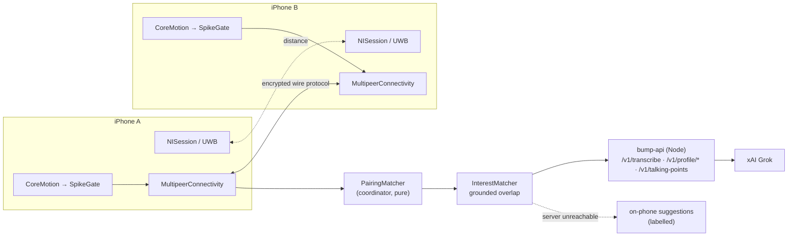

<div align="center">


**Meet someone. Find your overlap.**

Two people tap their phones together, confirm each other, and get the specific
things they actually have in common — plus a few grounded talking points to open
with. No account, no feed, no API key on the phone.


[The problem](#the-problem) · [What it does](#what-it-does) · [The shortest two-phone test](#the-shortest-two-phone-test) · [How it works](#how-it-works) · [Tech stack](#tech-stack) · [Why it matters](#why-it-matters) · [What we know and dont know](#what-we-know-and-dont-know) · [Roadmap](#roadmap)

</div>

---

## The problem

**Proximity does not guarantee connection.** One in six people worldwide
experiences loneliness ([WHO Commission on Social Connection,
2025](https://www.who.int/publications/i/item/9789240110403)). Being around
people — a lecture hall, a conference floor, a neighbourhood event — is not the
same as feeling connected to them.

**The first hello is where it stalls.** We systematically underestimate how much
other people want to talk to us. Epley & Schroeder (2014) assigned train and bus
commuters either to talk to a stranger or to keep to themselves; the ones told to
talk reported a *more* positive commute, while a separate group had predicted
solitude would feel better. Sandstrom & Boothby (2021) found the same pattern
across seven studies: people worried about being liked, about what to say, and
about whether the other person would even enjoy it — and their conversations
generally went better than they expected.

That gives BUMP a specific place to be useful: **the uncertainty right before the
first hello.** Not matchmaking, not a friendship algorithm — just a reason to
open your mouth.

> These studies explain mistaken expectations about conversation. They do not
> establish that hesitation causes loneliness, and they are not evidence that
> BUMP works. See [What we know and don't know](#what-we-know-and-dont-know).

### Why distinctive overlap, not just any overlap

"We both like music" is not a conversation. "You build modular synths too?" is.
Alves (2018) found people rated potential partners more positively when they
shared a *rare* interest rather than a common one — though those were ratings of
profiles, not real conversations. Vélez et al. (2019) added a useful detail:
shared *knowledge* mattered more than simply both liking something on first
exposure, which suggests the interesting part is the experience behind the
overlap.

So BUMP ranks for distinctiveness and attaches the evidence from both cards,
rather than reporting the largest number of matches it can find. That is a
research-inspired product hypothesis, not a validated ranking.

## What it does

> Today BUMP is an iOS app for two-or-more phones in the same room, plus a small
> server for the voice intro and Grok talking points. There is no Android build
> and no web app; the site in [`web/`](web/README.md) is marketing only.

**The iOS app**

- Onboards you by **voice** — speak an intro (≤ 45 s, or type it), answer up to three follow-ups, approve an editable card.
- **Start bumping** puts you in an automatic nearby room. No event code, no host, no setup.
- Tap the two phones together once; both sides **confirm the partner by name** before anything is exchanged.
- Shows up to three **shared interests with evidence** from both cards, plus one opener, and saves the connection locally.
- Degrades cleanly: no UWB, no on-device AI, or no server all still produce a usable bump, and the app says which path it took.

**What stays on the phones**

- Bumping, partner matching and the profile exchange happen **directly between the phones in the room**.
- The profile exchange is partner-only and encrypted, and each person chooses whether their data reaches the server at all.
- Talking points go to the server only when **both** people allowed it; otherwise they are drafted on-phone and labelled as such.

**The server** ([`backend/`](backend/README.md)) holds the `XAI_API_KEY` and does
the speech-to-text and Grok structured outputs. Every fact it returns must quote
the person's own words; anything that fails that check is dropped rather than
smoothed over.

## Quick start

```bash
open ios/UWBBumpTest.xcodeproj        # then follow ios/README.md for signing

cd backend && cp .env.example .env    # put your XAI_API_KEY in .env
npm start                             # http://0.0.0.0:8787

cd web && npm install && npm run dev  # http://localhost:5173
```

Prerequisites: a Mac with **Xcode 26+**, **two iPhones**, and Node **20+** for the
server. Deployment target is iOS 17. UWB and Apple Intelligence are both optional.
The Simulator cannot validate UWB or motion — two physical phones are the only
real test.

## The shortest two-phone test

1. Build and run on **both** phones.
2. Onboard on both. **Give them at least one interest in common.**
3. Both: Bump tab → **Start bumping**. The phones find each other automatically; one quietly becomes the coordinator.
4. When "1 person nearby" shows, **tap the phones together once**.
5. Both: **Confirm & share interests**.
6. Shared interests and talking points appear on both → **Save connection**.

For a large event, **Have an event code?** on the Bump tab still gives named rooms
(8 phones each). Instrumentation — live acceleration, live UWB distance, pairing
sliders, event log, diagnostics export — lives in **You ▸ Testing tools**,
deliberately out of the normal flow.

## How it works



1. **Motion only says *that* you were tapped.** `SpikeGate` is a pure threshold / rearm / cooldown state machine over CoreMotion; it never knows who tapped.
2. **The coordinator decides *who*.** One phone pairs bumps by its own arrival times. UWB distance, when available, is much stronger evidence about which peer — but it is evidence, not a requirement.
3. **Ambiguity is rejected, not guessed.** When several people bump at the same instant, that genuinely cannot identify partners, so BUMP refuses and offers a manual pick that is recorded honestly as a manual pick.
4. **Overlap is grounded.** `InterestMatcher` only reports an interest both cards support, with the evidence attached. Talking points are candidates backed by both cards before any model sees them.
5. **The server is one client of that, not the source of truth.** `ConversationService` tries Grok via `bump-api`, then Apple's Foundation Models, then a deterministic local drafter — and labels which one it used.

### Silence and honesty are the defaults

No overlap found, no partner confirmed, no server, no permission: the app says so
plainly rather than inventing something. The backend returns `502` rather than
fallback content when nothing it received survives grounding checks. The app's
own fallbacks are always marked as fallbacks.

## Tech stack

| Area | What's used |
|---|---|
| iOS app | Swift + SwiftUI, deployment target iOS 17 |
| Sensing | CoreMotion (tap detection), Nearby Interaction / `NISession` (UWB distance) |
| Transport | MultipeerConnectivity, encrypted, behind a swappable `PeerTransport` |
| Wire format | Versioned, bounded, idempotent messages (`WireProtocol`) |
| On-device AI | Apple Foundation Models, optional, with a deterministic local drafter behind it |
| Design | `Theme.swift` colour roles / shape / type / motion + `Components.swift` |
| Backend | Zero-dependency Node.js ≥ 20, plain `node:http`, contract in [`backend/CONTRACT.md`](backend/CONTRACT.md) |
| Models | xAI Grok (`grok-4.3`) for drafting and talking points, `grok-voice-transcribe-2.0` for speech |
| Marketing site | React 19 + TypeScript 5.9 + Vite 7, one scrubbed GSAP/ScrollTrigger sequence |
| Testing | XCTest (100 unit tests), `node --test` (42 mocked), live smoke script, Playwright for the site |

### Repository layout

| | What it is | Status |
|---|---|---|
| [**`ios/`**](ios/README.md) | The product. Onboarding, motion, UWB, pairing, interest matching, talking points. | Builds clean. 100 unit tests (96 pass, 4 server-contract tests skipped). Inspected in the Simulator and on one iPhone. **Unproven on two physical phones.** |
| [`backend/`](backend/README.md) | `bump-api`, the Node service between the app and xAI. Holds the key. | 42 mocked tests pass; live smoke test against xAI passed. |
| [`web/`](web/README.md) | The marketing site. | Built. Verified across both breakpoints, reduced motion, resize and fast scroll. |
| [`RESULTS.md`](RESULTS.md) | Blank results templates for the MVP and the original spikes. | To fill in on test day. |

## What we know and don't know

How well pairing holds up in a crowded room **has not been measured yet**. The
number that decides it is the **rejection rate**, reported separately from
accuracy in [`RESULTS.md`](RESULTS.md) — rejecting everything would otherwise
score as perfect.

Also open: whether the research above transfers at all — every study cited in
[The problem](#the-problem) motivates the design, and none of them tested BUMP.
Whether a distinctive shared interest actually makes the first hello easier is
the hypothesis, still unmeasured.

Beyond that: whether UWB availability in practice is high enough to matter,
whether voice onboarding is fast enough that people finish it standing up, and whether
grounded overlap reads as insight or as a restatement of what you just typed.

## Why it matters

Not every conversation has to become a friendship to be worth having. Sandstrom
& Dunn (2014) found students reported greater happiness and belonging on days
they interacted with more classmates than usual, and their wider work links
weak-tie interaction to well-being. That is an association, not proof that the
extra conversations caused it — but it is a reason to value the small ones: a
chat before class, a familiar face at a community event, a shared interest in an
unfamiliar room.

AI starts it. People make it matter.

## Roadmap

None of this is in the current build.

- [ ] **A real two-phone session**, measured, with `RESULTS.md` filled in.
- [ ] **Crowded-room testing** — many simultaneous bumps, rejection rate under load.
- [ ] **Android**, or the honest conclusion that the UWB path can't cross platforms.
- [ ] **Connection follow-up** — an export or share of a saved connection.
- [ ] **Event mode polish** — larger rooms than 8 phones per code.

## Acknowledgments

Built on Apple's Nearby Interaction and MultipeerConnectivity frameworks and the
xAI Grok API. The design is informed by the WHO Commission on Social Connection
(2025), Epley & Schroeder (2014), Sandstrom & Boothby (2021), Sandstrom & Dunn
(2014), Alves (2018) and Vélez et al. (2019) — none of whom studied BUMP. An earlier Node + Socket.io browser experiment was removed from the
tree; it is still in git history at commit `278d2e0` if the matching algorithm or
the browser `devicemotion` work is ever needed again.

## License

_No license file yet._
